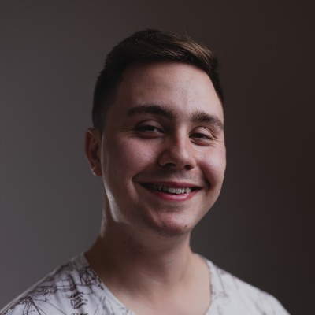

# O Nas

Jesteśmy młodym kołem, którego ideą jest zebranie interesujących ludzi a następnie stworzenie z nimi coś wspaniałego. Naszym celem jest tworzenie gier na produkcje którch składają się programiści, graficy, muzycy, game desinerzy oraz menadżerowie. Umożliwiamy rozwój każdemu w wszelakich dziedinach kunsztu. U nas spotkach osoby podomne sobie z którymi będziesz mógł stworzyć swoją wymarzoną grę.

# Wyznajemy wartości

- ### Ambicja i Zaangażowanie
  Są głównym motorem napędowym gwarantującym sukces
- ### Szacunek
  Szanujemy czas, zdanie i pracę innych członków, aby stworzyć przyjazne miejsce dla rozwoju.
- ### Samorozwój
  Wewnętrzna chęć poszerzania wiedzy i dzielenia się nią z innymi pozwala na tworzenie wysokiej jakości projektów.
- ### Otwartość i Odwaga
  Stawiamy sobie jasne cele, otwarcie rozmawiamy o problemach i odważnie proponujemy nowe rozwiązania.

# Nasze Aktualne Projekty

## AMS

Dawno temu odbyła sie koniunkcja sfer która przelała całą swą magię do naszego świata. Parę tysięcy lat później ludzie opanowi wykorzystywać tą tajemniczą siłe do własnych celów. nasz bohater uczi się na jednej z renomowanej uczeli magii zwanej AGH która okazuję się, że posiada w swoich dawnych kryptach potężny artefakt zdolny usunąć magie z świata. Nasz bohater uczy się coraz no nowych zakleć i próbuje odnaleźć artefakt oraz go zniszczyć zanim wykorzysta go niepowołana osoba.

---

## HASTAR

Budzisz się w świeceie opanowanym przez sztuczną inteligencje. Z niewidomych powodów jako jedyny nie jesteś pod panowaniem AI. Zostałeś ostatnioą nadzieją ludzkości. Korzystając z swojego M4A4 niszczysz cały wykreowany przez AI świat równocześnie uwalniajac ludzkość z jej kajdan.

---

## ARCHIMEDES

Nasz zespół z pełnym zapałem projektuje swój własny silnk graficzny którego zgłębiane przyniesie nam wiele wiedzy na temat ich złożoności oraz pomoże pisać bardziej optymalny kod.

---

## EMPEROR

Jest to świat inspirowany dziełami Tolkiena w którym smoki oraz napady orków to codzienność. Gracz wciela się w kolonizatora kótry musi rozbudować swoje imperium na nowych nieznanych ziemiach. Wykorzytuje do tego pobliskie zasoby jak drwno, cenne rudy oraz inne zasoby. Z pracy mieszkańców może wyprodukować przeróżne dobra zaczynając od pożywienia a kończąc na bronia i zbrojach przyodzewanych przez żołnierzy. Celem jest rozwinięcie gospodarki tak by każdy aspek produkcji sie zazębiał oraz wykorzystanie jej do sworzenia armi która podbije sąsiedne krainy.

---

## RACING CAR

Cofasz się do lat 80, gdzie jadąc Ford Ranger próbujesz w najpeszy sposób wykorzystać przyczepność opon oraz nitro płynące w rurach auta. celem graczas jest pokonianie wybranej trasy w jak najkrótszym czasie.

# SZUKAMY

- ### Programistów

  Będziesz odpowiedzialny za implementowanie rozgrywki oraz fizyki w naszych grach. Chyba, że wolisz wykrywać kolizję, wyprowadzać fizykę od postaw i robić inne rzeczy związane z tworzeniem silnika gry, to też znajdziemy dla ciebie miejsce.

- ### Grafików

  Jeśli masz doświadczenie w tworzeniu grafiki 3D i 2D to dobrze trafiłeś.

- ### Game designerów

  Żeby ciekawy temat mógł stać się pełnoprawną grą trzeba mu nadać głębszy sens, sprecyzować wygląd oraz fabułę. Twoim zadaniem będzie uwydatnić nasze obecne projekty, a także dawać życie tym nowym.

- ### Lider zespołu od social mediów

  Twoim zadaniem będzie kierowanie całymi social mediami. Wymyślanie tematyki postów i sprawianie, że będziemy gromadzić coraz większą społeczność. Jeżeli uważasz się za dobrego lidera i masz pomysł jak przyciągnąć ludzi na nasze social media, to właśnie to stanowisko jest idealne dla ciebie.

- ### Twórca grafik do postów

  Jeśli wiesz, że twoja twórczość zaintryguje ludzi przeglądających nasz profil, to właśnie to stanowisko jest idealne dla Ciebie! Jeśli robiłeś już kiedyś coś podobnego na innym fanpage'u, to również możesz się tym podzielić.

- ### Montażysta filmów

  Będziesz odpowiedzialny za składanie w całość filmików podsumowujących wydarzenia organizowane przez koło. Jeśli masz doświadczenie z tym związane, to dobrze trafiłeś.

- ### Twórca rolek na social media

  Będziesz mógł tworzyć rolki na nasze social media podsumowujące wydarzenia w naszym Kole oraz materiały związane z szeroko pojętym gamedevem - liczymy na twoją kreatywność!

- ### Autor postów
  Jeśli uważasz, że informowanie ludzi o zbliżających się wydarzeniach w naszym kole i podsumowywanie tych minionych, to coś w czym byś się spełniał, to właśnie to stanowisko jest dla Ciebie!

## [Ankieta Rekrutacyjna](https://docs.google.com/forms/d/e/1FAIpQLSea84KKPaQeEUNiI3IWRyXT8eW7Ypyq_sDhoNr2_jZoYqg2kw/closedform)

# Eventy

- ## hackathon

  Całedobowe kodzenie gier to nie jest problem dla naszych członków. U nas możesz zebrać własny team z którym spędzisz niezapomiane noce projektując grę oraz walcząc z snem z energetykiem w ręce.

- ## Code Along

  Organizujemy własne noce programistyczne w których poznasz oraz będziesz rywalizowac z członaki naszego koła. przypomną Ci one o młodzieńczysz nocach przed kompem grająć w CS.

- ## Warsztaty

  
  
  

  Prowadzimy warsztaty z szerokiego zakresu tematów.

  - Podstawy gita(który jest niezbędny przy pracy zespołowej)
  - Głębsze poznanie silnika Unity
  - Techniki Agile
  - Wykorzystanie wzorców projektowych
  - Modelowanie 3D
  - Projektowenie grafik 2D
  - Oraz inne poruszające życie Game Developera

- ## Wyjazdy Integracyjne

  
  
  

  Organizujemy przeróżne wyjazdy intergracyjne. Jednym z nich był 3-dniowy wyjazd do Poronina gdzie wszysycy mogli zaznać przepięknych górskich krajobrazów jak i szmpańsko się bawić na wieczornych imperzach

# Zarząd

- ## Maciej Pieniążek

  

  Gółwny przedstawiciel koła. Jego rolą jest spajanie i rozwijanie koła. Zajmuje się zbieranie nowych wpływów oraz zarządznie aktualnymi wydarzeniami w kole.

- ## Patryk Lesiak

  

  Guru IT. Zajmusie się aspektem technicznym koła. Administrator Discora, Chmur, itd. Na jego barkach leżą losy osbób zmagających się z problemami w Unity

- ## Adrian Markowski

  

  Kordynator warsztatów, oraz code along. Także zarządca fanpagu facebooka.

- ## Jakub Ocytko

  

  Działacz na rzecz rozwoju technicznego członów.

- ## Anotoni Zieciak

  

  Osoba odpowiedzilna przeróżne ankiety. Jest on naszym człowiekim wśród ludzi. Jeżeli masz jakiś problem czy zażalenie zwróć się do Antka.

- ## Tomasz Makowski

  

  Prowadzony spotkania koła, także inicjator oraz organizator wyjadów intergracyjnych.

- ## Wojciech Neuman

  

  Okno na świat koła. Zajmuje się promowanie i rozpowszechnieniem koła 2 social mediach.

...
