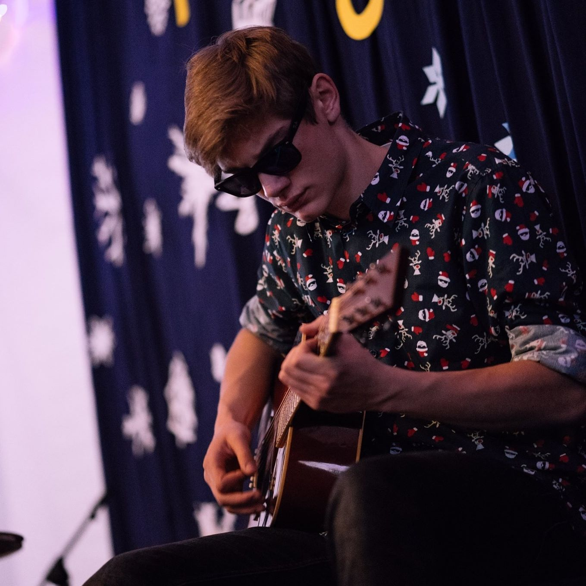

# O Nas

Jesteśmy młodym kołem, którego ideą jest zebranie interesujących ludzi a następnie stworzenie z nimi coś wspaniałego. Naszym celem jest produkcja gier w których angażują się programiści, graficy, muzycy, game designerzy oraz menadżerowie. Umożliwiamy rozwój każdemu w wszelakich dziedzinach kunsztu. U nas spotkasz osoby podobne sobie z którymi będziesz mógł stworzyć swoją wymarzoną grę.

# Wyznajemy wartości

- ### Ambicja i Zaangażowanie

Są głównym motorem napędowym gwarantującym sukces

- ### Szacunek

Szanujemy czas, zdanie i pracę innych członków, aby stworzyć przyjazne miejsce dla rozwoju.

- ### Samorozwój

Wewnętrzna chęć poszerzania wiedzy i dzielenia się nią z innymi pozwala na tworzenie wysokiej jakości projektów.

- ### Otwartość i Odwaga

Stawiamy sobie jasne cele, otwarcie rozmawiamy o problemach i odważnie proponujemy nowe rozwiązania.

# Nasze Aktualne Projekty

## AMS

Dawno temu odbyła się koniunkcja sfer, która przelała całą swą magię do naszego świata. Parę tysięcy lat później ludzie opanowali tę tajemniczą siłę do własnych celów. Nasz bohater uczy się na jednej z renomowanych uczelni magii zwanej AGH, która posiada w swoich dawnych kryptach potężny artefakt zdolny usunąć magie ze świata. Nasz bohater zgłębia tajniki magii oraz próbuje odnaleźć pradawny artefakt, zanim użyje go niepowołana osoba.

---

## HASTAR

Budzisz się w świecie opanowanym przez sztuczną inteligencję. Z niewidomych powodów jako jedyny nie jesteś pod panowaniem AI. Jesteś ostatnią nadzieją ludzkości. Korzystając ze swojego M4A1, niszczysz cały wykreowany przez AI świat, równocześnie uwalniając ludzkość z jej kajdan.

---

## ARCHIMEDES

Nasz zespół z pełnym zapałem projektuje swój własny silnik graficzny, którego zgłębianie przyniesie nam wiele wiedzy na temat ich złożoności. Zdobyte doświadczenie przybliży nas do jak najefektywniejszego wykorzystania zasobów komputera.

---

## EMPEROR

Jest to świat inspirowany dziełami Tolkiena, w którym smoki oraz napady orków to codzienność. Gracz wciela się w kolonizatora, który musi rozbudować swoje imperium na nowych nieznanych ziemiach. Wykorzystuje do tego pobliskie zasoby takie jak drewno, cenne rudy oraz inne bogactwa. Z pracy mieszkańców może wyprodukować przeróżne dobra, zaczynając od pożywienia a kończąc na broniach i zbrojach przyodziewanych przez żołnierzy. Celem jest rozwinięcie gospodarki, tak by każdy aspekt produkcji się zazębiał oraz wykorzystanie jej do stworzenia armii, która podbije sąsiednie krainy.

---

## RACING CAR

Cofasz się do lat 80, gdzie jadąc Ford Ranger próbujesz w najlepszy sposób wykorzystać przyczepność opon oraz nitro płynące w rurach auta Celem gracza jest pokonanie wybranej trasy w jak najkrótszym czasie.

# Eventy

- ## Hackathon

  Całodobowe kodowanie gier to nie jest problem dla naszych członków. U nas możesz zebrać własny team, z którym spędzisz niezapomniane noce.

- ## Code Along

  Organizujemy własne noce programistyczne, w których poznasz oraz będziesz rywalizować z członkami naszego koła. Przypomną Ci one o młodzieńcze noce grania.

- ## Warsztaty

  

  

  

  Prowadzimy warsztaty z szerokiego zakresu tematów.

  - Podstawy gita(który jest niezbędny przy pracy zespołowej)

  - Głębsze poznanie silnika Unity

  - Techniki Agile

  - Wykorzystanie wzorców projektowych

  - Modelowanie 3D

  - Projektowanie grafik 2D

- ## Wyjazdy Integracyjne

  

  

  

  Nasi specjaliści codziennie myślą na coraz to nowymi wyprawami. Jednym z nich był 3-dniowy wyjazd do Poronina gdzie wszyscy mogli zaznać przepięknych górskich krajobrazów jak i szampańsko się bawić na wieczornych imprezach.

# SZUKAMY

- ### Programistów

Będziesz odpowiedzialny za implementowanie rozgrywki oraz fizyki w naszych grach. Chyba że wolisz wykrywać kolizję, wyprowadzać fizykę od postaw i robić inne rzeczy związane z tworzeniem silnika gry, to też znajdziemy dla ciebie miejsce.

- ### Grafików

Jeśli masz doświadczenie w tworzeniu grafiki 3D i 2D to dobrze trafiłeś.

- ### Game designerów

Żeby ciekawy temat mógł stać się pełnoprawną grą trzeba mu nadać głębszy sens, sprecyzować wygląd oraz fabułę. Twoim zadaniem będzie uwydatnić nasze obecne projekty, a także dawać życie tym nowym.

- ### Lider zespołu od social mediów

Twoim zadaniem będzie kierowanie całymi social mediami. Wymyślanie tematyki postów i sprawianie, że będziemy gromadzić coraz większą społeczność. Jeżeli uważasz się za dobrego lidera i masz pomysł jak przyciągnąć ludzi na nasze social media, to właśnie to stanowisko jest idealne dla ciebie.

- ### Twórca grafik do postów

Jeśli wiesz, że twoja twórczość zaintryguje ludzi przeglądających nasz profil, to właśnie to stanowisko jest idealne dla Ciebie! Jeśli robiłeś już kiedyś coś podobnego na innym fanpage'u, to również możesz się tym podzielić.

- ### Montażysta filmów

Będziesz odpowiedzialny za składanie w całość filmików podsumowujących wydarzenia organizowane przez koło. Jeśli masz doświadczenie z tym związane, to dobrze trafiłeś.

- ### Twórca rolek na social media

Będziesz mógł tworzyć rolki na nasze social media podsumowujące wydarzenia w naszym Kole oraz materiały związane z szeroko pojętym gamedevem - liczymy na twoją kreatywność!

- ### Autor postów

Jeśli uważasz, że informowanie ludzi o zbliżających się wydarzeniach w naszym kole i podsumowywanie tych minionych, to coś w czym byś się spełniał, to właśnie to stanowisko jest dla Ciebie!

## [Ankieta Rekrutacyjna](https://docs.google.com/forms/d/e/1FAIpQLSea84KKPaQeEUNiI3IWRyXT8eW7Ypyq_sDhoNr2_jZoYqg2kw/closedform)

# Zarząd

## Maciej Pieniążek

Główny przedstawiciel koła. Jego rolą jest spajanie i rozwijanie koła. Zajmuje się zbieraniem nowych wpływów oraz zarządzaniem aktualnymi wydarzeniami w kole.

---

## Patryk Lesiak

Guru IT. Zajmuje się aspektem technicznym koła. Administrator discorda, chmur, itd. Na jego barkach leżą losy osób zmagających się z problemami w Unity.

---

## Adrian Markowski

Koordynator warsztatów oraz code along. Także zarządca fanpage'a Facebooka.

---

## Jakub Ocytko

Działacz na rzecz rozwoju technicznego członków.

---

## Antoni Zięciak

Osoba nietuzinkowa będąca uosobieniem każdego idola. Jeżeli szukasz sensu życia i nie wiesz dokąd pójść, to zacznij podążać za Antonim.

---

## Tomasz Makowski

Prowadzący spotkania koła, także inicjator oraz organizator wyjazdów integracyjnych.

---

## Wojciech Neuman

Okno na świat koła. Zajmuje się promowaniem i rozpowszechnianiem koła w social mediach.
